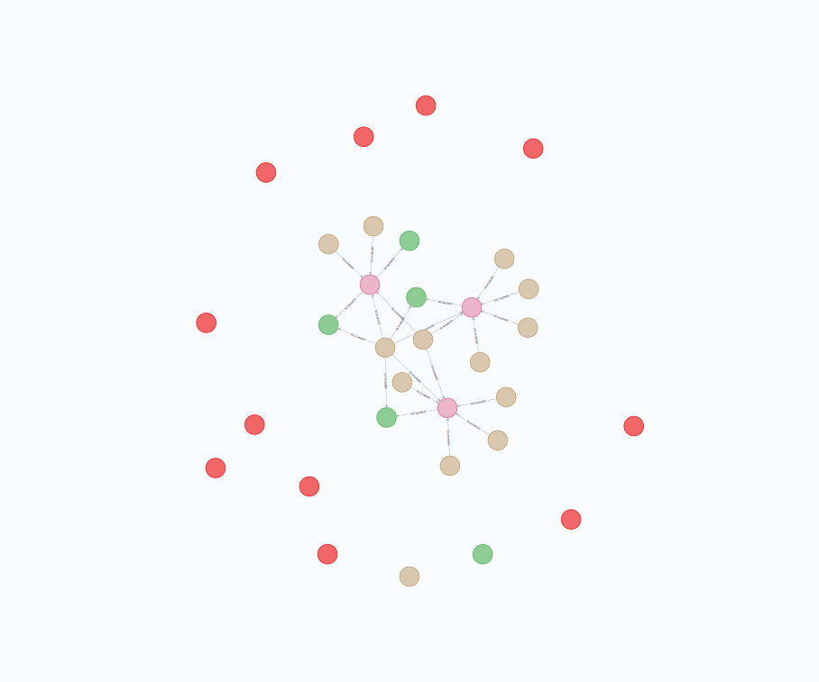
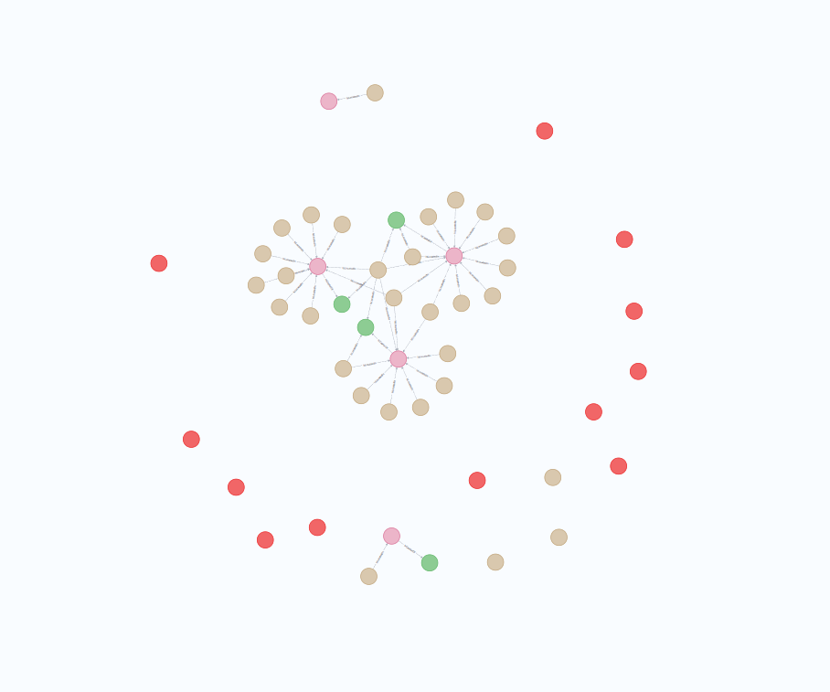
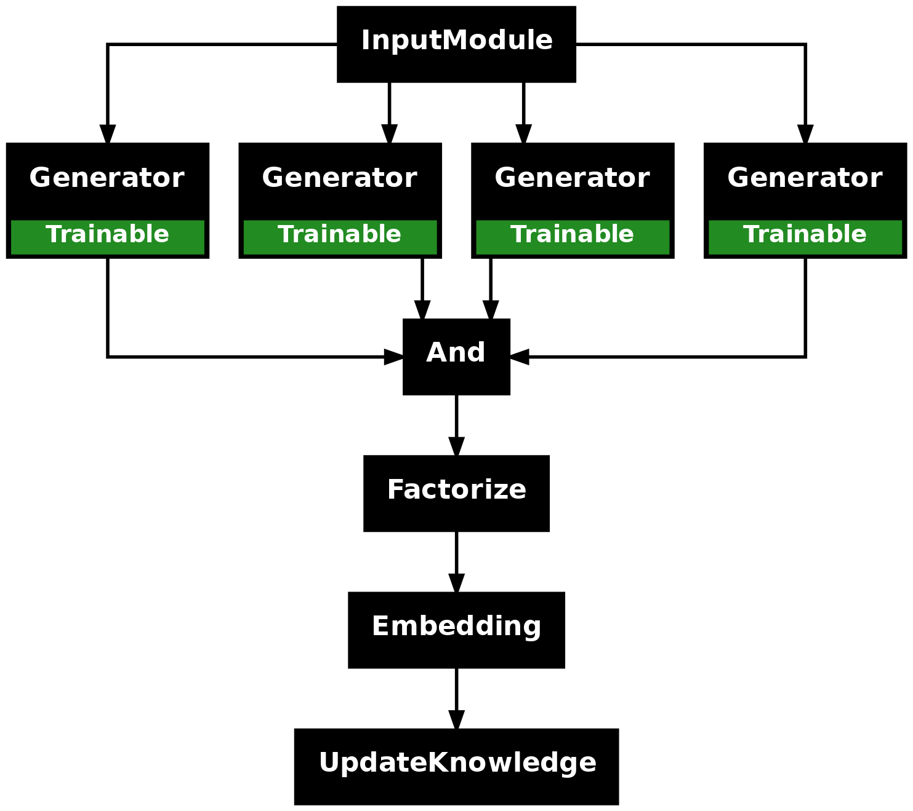
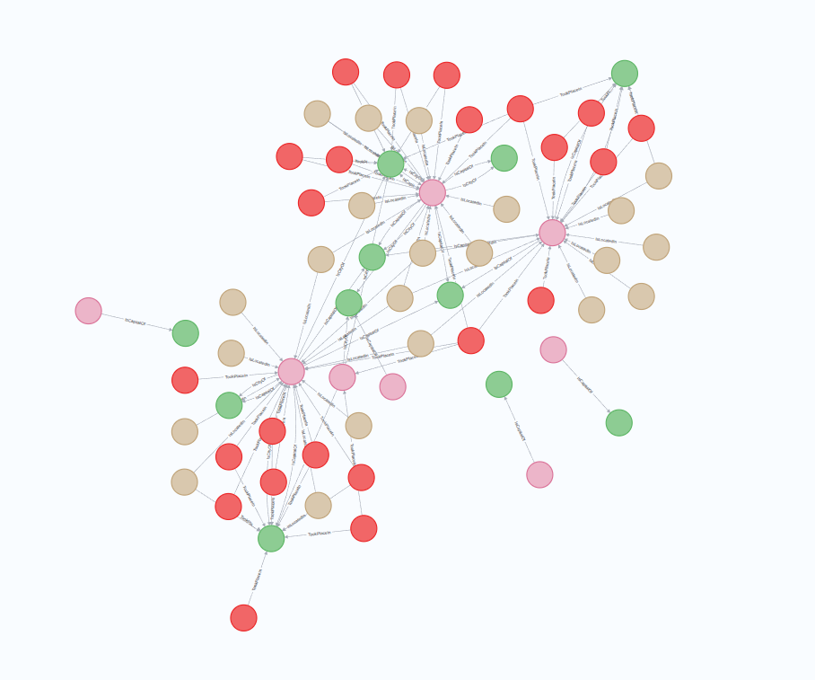

# Knowledge Extraction

Knowledge extraction from unstructured data is a cornerstone of neuro-symbolic AI applications, enabling systems to transform raw text into structured, queryable information. Synalinks provides a sophisticated framework that supports constrained property graph extraction and querying, offering unprecedented flexibility in how you architect your knowledge extraction pipelines.

Synalinks leverages constrained property graphs as its foundation, where the schema is rigorously enforced through constrained JSON decoding. This approach ensures data integrity while maintaining the flexibility to store extracted knowledge in dedicated graph databases for efficient querying and retrieval.
The framework's modular design allows you to compose extraction pipelines from discrete, reusable components. Each component can be optimized independently, tested in isolation, and combined with others to create sophisticated data processing workflows.

To illustrate our approach, we are going to use the same small language model with different architectures. So you can understand the pro and cons of each approach.

```python
import synalinks
import asyncio
from typing import Literal
from typing import List
from typing import Union

# We start by defining our input data, in that case a simple Document

class Document(synalinks.DataModel):
    filename: str
    content: str

```

For the graph schema, we are going to use the same as presented in the previous lesson.

## Modular Architecture with Granular Control

The true strength of Synalinks emerges from its modular approach to pipeline composition. This foundation allows you to modularize the granularity of your data pipelines and recombine them with precision, adapting to the varying computational requirements of different extraction tasks.

In production environments, data models often exhibit vastly different inference complexities. Some entities require sophisticated reasoning and substantial computational resources to extract accurately, while others can be identified through lightweight pattern matching. A rigid, one-size-fits-all approach typically leads to suboptimal resource utilization and compromised accuracy.

Synalinks addresses this challenge by enabling you to decompose complex extraction tasks into specialized stages, each optimized for its specific requirements. This granular control allows you to allocate computational resources where they're most needed while maintaining overall pipeline efficiency.

### One-Stage Extraction

For scenarios where you have access to powerful language models capable of handling complex, multi-faceted extraction tasks, the one-stage approach offers simplicity and directness. This method excels when working with large proprietary models that possess the capacity to simultaneously identify entities, infer relationships, and maintain semantic coherence across the entire knowledge graph.

```python

# We group the entities and relations in a knowledge graph

class Knowledge(synalinks.KnowledgeGraph):
    entities: List[Union[City, Country, Place, Event]]
    relations: List[Union[IsCapitalOf, IsLocatedIn, IsCityOf, TookPlaceIn]]


async def one_stage_program(
    language_model: synalinks.LanguageModel,
    knowledge_base: synalinks.KnowledgeBase,
):
    inputs = synalinks.Input(data_model=Document)
    knowledge_graph = await synalinks.Generator(
        data_model=Knowledge,
        language_model=language_model,
    )(inputs)
    embedded_knowledge_graph = await synalinks.Embedding(
        embedding_model=embedding_model,
    )(knowledge_graph)

    program = synalinks.Program(
        inputs=inputs,
        outputs=outputs,
        name="two_stage_extraction",
        description="A two stage KG extraction pipeline",
    )

    synalinks.utils.plot_program(
        program,
        to_folder="examples/knowledge_extraction",
        show_trainable=True,
    )

    return program

```


The one-stage approach minimizes latency and reduces the complexity of pipeline orchestration. However, it demands models with substantial reasoning capabilities and may not be effective for scenarios involving smaller, specialized models.

#### Resulting Graph



### Two-Stage Extraction

The two-stage approach represents a strategic decomposition of the extraction process, separating entity identification from relationship inference. This separation allows for specialized optimization at each stage and provides greater control.

```python

class MapEntities(synalinks.Entities):
    entities: List[Union[City, Country, Place, Event]]

class MapRelations(synalinks.Relations):
    relations: List[Union[IsCapitalOf, IsLocatedIn, IsCityOf, TookPlaceIn]]


async def two_stage_program(
    language_model: synalinks.LanguageModel,
    knowledge_base: synalinks.KnowledgeBase,
):
    inputs = synalinks.Input(data_model=Document)
    entities = await synalinks.Generator(
        data_model=MapEntities,
        language_model=language_model,
    )(inputs)
    
    # inputs_with_entities = inputs AND entities (See Control Flow tutorial)
    inputs_with_entities = inputs & entities
    relations = await synalinks.Generator(
        data_model=MapRelations,
        language_model=language_model,
    )(inputs_with_entities)
    
    # knowledge_graph = inputs AND entities (See Control Flow tutorial)
    knowledge_graph = entities & relations

    embedded_knowledge_graph = await synalinks.Embedding(
        embedding_model=embedding_model,
    )(knowledge_graph)

    updated_knowledge_graph = await synalinks.UpdateKnowledge(
        knowledge_base=knowledge_base,
    )(embedded_knowledge_graph)

    outputs = updated_knowledge_graph

    program = synalinks.Program(
        inputs=inputs,
        outputs=outputs,
        name="two_stage_extraction",
        description="A two stage KG extraction pipeline",
    )

    synalinks.utils.plot_program(
        program,
        to_folder="examples/knowledge_extraction",
        show_trainable=True,
    )
    return program

```


This staged approach offers several advantages: entities can be extracted using lightweight models optimized for named entity recognition, while relationship inference can leverage more sophisticated reasoning models.

#### Resulting Graph



### Multi-Stage Extraction

If you have heterogeneous data models, or if you are using small language models (SLMs), you might want to consider using a separate generator for each entity or relation to extract. This approach enhances the predictions of LMs by making one call per entity or relation type, thereby reducing the scope of the task for each call and enhancing accuracy. You can then combine the results of your extraction using logical operators (`And` or `Or`), depending on whether you want your aggregation to be robust to failures from the LMs.

```python
import synalinks
import asyncio
from typing import List

from knowledge_graph_schema import City, Country, Place, Event
from knowledge_graph_schema import IsCapitalOf, IsLocatedIn, IsCityOf, TookPlaceIn
from knowledge_dataset import Document, load_data


class Cities(synalinks.Entities):
    entities: List[City] = synalinks.Field(
        description="A list exclusively containing city entities, such as 'Tokyo' or 'London'.",
    )


class Countries(synalinks.Entities):
    entities: List[Country] = synalinks.Field(
        description="A list exclusively containing country entities, such as 'Japan' or 'United Kingdom'.",
    )


class Places(synalinks.Entities):
    entities: List[Place] = synalinks.Field(
        description="A list exclusively containing place entities, which could be landmarks or points of interest, such as 'Mount Fuji' or 'Big Ben'.",
    )


class Events(synalinks.Entities):
    entities: List[Event] = synalinks.Field(
        description="A list exclusively containing event entities, such as 'Olympic Games' or 'Coachella Festival'.",
    )


class IsCapitalOfRelations(synalinks.Relations):
    relations: List[IsCapitalOf] = synalinks.Field(
        description="A list of relations specifically describing capital-city relationships between city and country entities.",
    )


class IsCityOfRelations(synalinks.Relations):
    relations: List[IsCityOf] = synalinks.Field(
        description="A list of relations specifically describing the association of cities as part of countries.",
    )


class IsLocatedInRelations(synalinks.Relations):
    relations: List[IsLocatedIn] = synalinks.Field(
        description="A list of relations specifically describing the geographical containment of places within cities or countries.",
    )


class TookPlaceInRelations(synalinks.Relations):
    relations: List[TookPlaceIn] = synalinks.Field(
        description="A list of relations specifically describing the occurrence of events within cities or countries.",
    )


async def main():
    language_model = synalinks.LanguageModel(
        model="ollama/mistral",
    )

    embedding_model = synalinks.EmbeddingModel(
        model="ollama/mxbai-embed-large",
    )

    knowledge_base = synalinks.KnowledgeBase(
        index_name="neo4j://localhost:7687",
        entity_models=[City, Country, Place, Event],
        relation_models=[IsCapitalOf, IsLocatedIn, IsCityOf, TookPlaceIn],
        embedding_model=embedding_model,
        metric="cosine",
        wipe_on_start=True,
    )

    inputs = synalinks.Input(data_model=Document)
    cities = await synalinks.Generator(
        data_model=Cities,
        language_model=language_model,
    )(inputs)
    countries = await synalinks.Generator(
        data_model=Countries,
        language_model=language_model,
    )(inputs)
    places = await synalinks.Generator(
        data_model=Places,
        language_model=language_model,
    )(inputs)
    events = await synalinks.Generator(
        data_model=Events,
        language_model=language_model,
    )(inputs)

    is_capital_of_relations = await synalinks.Generator(
        data_model=IsCapitalOfRelations,
        language_model=language_model,
    )(inputs)
    is_located_in_relations = await synalinks.Generator(
        data_model=IsLocatedInRelations,
        language_model=language_model,
    )(inputs)
    is_city_of_relations = await synalinks.Generator(
        data_model=IsCityOfRelations,
        language_model=language_model,
    )(inputs)
    took_place_in_relations = await synalinks.Generator(
        data_model=TookPlaceInRelations,
        language_model=language_model,
    )(inputs)

    entities = await synalinks.And()([cities, countries, places, events])

    entities = entities.factorize()

    relations = await synalinks.And()(
        [
            is_capital_of_relations,
            is_located_in_relations,
            is_city_of_relations,
            took_place_in_relations,
        ]
    )
    relations = relations.factorize()

    knowledge_graph = entities & relations

    embedded_knowledge_graph = await synalinks.Embedding(
        embedding_model=embedding_model,
        in_mask=["name"],
    )(knowledge_graph)

    updated_knowledge_graph = await synalinks.UpdateKnowledge(
        knowledge_base=knowledge_base,
    )(embedded_knowledge_graph)

    outputs = updated_knowledge_graph

    program = synalinks.Program(
        inputs=inputs,
        outputs=outputs,
        name="multi_stage_extraction",
        description="A multi stage KG extraction pipeline",
    )

    synalinks.utils.plot_program(
        program,
        to_folder="examples/knowledge/extraction",
        show_trainable=True,
    )

    dataset = load_data()

    print("Starting KG extraction...")
    await program.predict(dataset, batch_size=1)
    print("Done.")


if __name__ == "__main__":
    asyncio.run(main())
```


#### Resulting Graph


### Dealing with Orphan Nodes

In some cases, specially if you want to use the `KnowledgeRetriever` you will have to extract nodes that are connected to each other. If intelligence is connecting the dot between your data, then orphan nodes are problematic.

To avoid them in SynaLinks, you only need to infer the relations, as they contains not only the id of subject and object entity, but the entities themselves. This approach make sure that each entity extracted will be connected at least to another.

```python
import synalinks
import asyncio
from typing import List

from knowledge_graph_schema import City, Country, Place, Event
from knowledge_graph_schema import IsCapitalOf, IsLocatedIn, IsCityOf, TookPlaceIn
from knowledge_dataset import Document, load_data


class IsCapitalOfRelations(synalinks.Relations):
    relations: List[IsCapitalOf] = synalinks.Field(
        description="A list of relations specifically describing capital-city relationships between city and country entities.",
    )


class IsCityOfRelations(synalinks.Relations):
    relations: List[IsCityOf] = synalinks.Field(
        description="A list of relations specifically describing the association of cities as part of countries.",
    )


class IsLocatedInRelations(synalinks.Relations):
    relations: List[IsLocatedIn] = synalinks.Field(
        description="A list of relations specifically describing the geographical containment of places within cities or countries.",
    )


class TookPlaceInRelations(synalinks.Relations):
    relations: List[TookPlaceIn] = synalinks.Field(
        description="A list of relations specifically describing the occurrence of events within cities or countries.",
    )


async def main():
    language_model = synalinks.LanguageModel(
        model="ollama/mistral",
    )

    embedding_model = synalinks.EmbeddingModel(
        model="ollama/mxbai-embed-large",
    )

    knowledge_base = synalinks.KnowledgeBase(
        index_name="neo4j://localhost:7687",
        entity_models=[City, Country, Place, Event],
        relation_models=[IsCapitalOf, IsLocatedIn, IsCityOf, TookPlaceIn],
        embedding_model=embedding_model,
        metric="cosine",
        wipe_on_start=True,
    )

    inputs = synalinks.Input(data_model=Document)

    is_capital_of_relations = await synalinks.Generator(
        data_model=IsCapitalOfRelations,
        language_model=language_model,
    )(inputs)
    is_located_in_relations = await synalinks.Generator(
        data_model=IsLocatedInRelations,
        language_model=language_model,
    )(inputs)
    is_city_of_relations = await synalinks.Generator(
        data_model=IsCityOfRelations,
        language_model=language_model,
    )(inputs)
    took_place_in_relations = await synalinks.Generator(
        data_model=TookPlaceInRelations,
        language_model=language_model,
    )(inputs)

    relations = await synalinks.And()(
        [
            is_capital_of_relations,
            is_located_in_relations,
            is_city_of_relations,
            took_place_in_relations,
        ]
    )
    relations = relations.factorize()

    embedded_relations = await synalinks.Embedding(
        embedding_model=embedding_model,
        in_mask=["name"],
    )(relations)

    updated_relations = await synalinks.UpdateKnowledge(
        knowledge_base=knowledge_base,
    )(embedded_relations)

    outputs = updated_relations

    program = synalinks.Program(
        inputs=inputs,
        outputs=outputs,
        name="relations_only_multi_stage_extraction",
        description="A multi stage KG extraction pipeline that only extract the relations",
    )

    synalinks.utils.plot_program(
        program,
        to_folder=FOLDER,
        show_trainable=True,
    )

    synalinks.utils.plot_program(
        program,
        to_folder="examples/knowledge/extraction",
        show_trainable=True,
    )

    dataset = load_data()

    print("Starting KG extraction...")
    await program.predict(dataset, batch_size=1)
    print("Done.")


if __name__ == "__main__":
    asyncio.run(main())
```



#### Resulting Graph



## Conclusion

Synalinks represents a paradigm shift in knowledge extraction, moving beyond monolithic, inflexible approaches toward a modular, production-first framework that adapts to the complexities of real-world applications.

The modular architecture enables teams to iteratively refine their extraction pipelines, starting with simple one-stage approaches and evolving toward sophisticated multi-stage systems as requirements become more complex. This evolutionary path reduces implementation risk while providing a clear migration strategy for growing applications.

By separating concerns across different stages, Synalinks allows for specialized optimization at each level of the extraction hierarchy. Entity extraction can leverage lightweight, fast models, while complex reasoning tasks can utilize more powerful, specialized models. This granular control over computational resources leads to more efficient systems that deliver better results at lower costs.

Whether you're building a simple entity extraction system or a comprehensive knowledge discovery platform, Synalinks provides the flexibility, control, and scalability needed to transform unstructured data into actionable insights.

In an era where structured data is the new oil, Synalinks provides the refinery that transforms raw information into structured knowledge, enabling organizations to unlock the full potential of their data assets through intelligent, adaptive extraction pipelines.

### Key Takeaways

- **Schema-First Design**: Synalinks enforces structured schemas through constrained JSON decoding, ensuring data integrity and consistency across your entire knowledge extraction pipeline. This contract-based approach prevents schema drift and enables reliable downstream processing.
- **Logical Flow Composition**: The framework's mathematical foundation allows for precise pipeline composition using logical operations. This enables sophisticated data flow patterns where outputs from one stage can be combined with inputs using python logical operators, creating complex but maintainable extraction workflows.
- **Modular Components**: Each pipeline component can be developed, tested, and optimized independently. This separation of concerns reduces complexity, improves maintainability, and enables teams to specialize in different aspects of the extraction process.
- **One-Stage for Simplicity**: Use single-stage extraction when you have access to powerful models capable of handling comprehensive extraction tasks. This approach minimizes latency and orchestration complexity but requires models with substantial reasoning capabilities.
- **Two-Stage for Balance**: Implement two-stage pipelines when you need to balance accuracy with computational efficiency. This approach allows specialized optimization for entity extraction and relationship inference while maintaining manageable complexity.
- **Multi-Stage for Sophistication**: Deploy multi-stage architectures for complex scenarios requiring diverse extraction types, specialized models for different tasks, and sophisticated reasoning capabilities. This approach maximizes flexibility and performance optimization opportunities.
- **Resource Optimization**: Different stages can utilize different models optimized for their specific tasks, leading to better resource utilization and cost efficiency. Lightweight models handle simple tasks while powerful models focus on complex reasoning.
- **Error Isolation**: Failures in one stage don't necessarily compromise the entire pipeline depending on the logical operators used. This resilience is crucial for production systems processing large volumes of heterogeneous data.

### How to go further ?

Synalinks KG data models are compatible with other modules, allowing you to easily enhance pipelines to make the extracted data more robust, depending on the data you want to extract. Ultimately, it is about deeply understanding the limitations of your language models (LMs) and having the ability, thanks to our modular approach, to address them. Keep also in mind, that you can train your generators to enhance their accuracy.

One might argue that this is a case-by-case, highly domain-specific development and not as straightforward as a one-size-fits-all solution. However, the reality is that companies want systems tailored to their specific business cases and optimized for them. You don't build defensible intellectual property with an average one-size-fits-all solution.