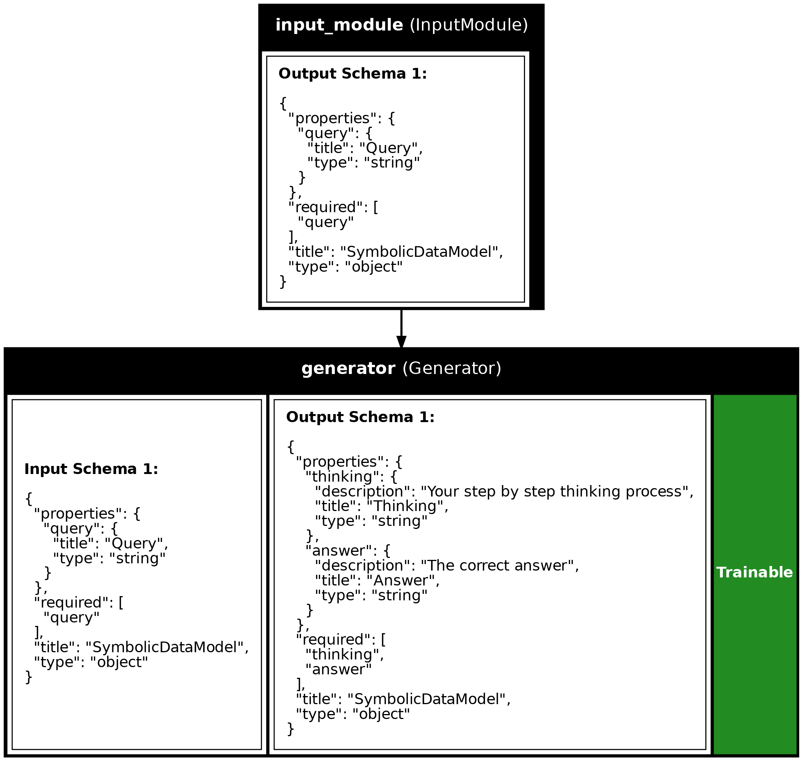

# Quickstart

## Install

```shell
pip install synalinks
```

or (recommended)

```shell
uv pip install synalinks
```

## Programming your application: 3 ways

### Using the `Functional` API

You start from `Input`, you chain modules calls to specify the model's forward pass, and finally, you create your model from inputs and outputs:

```python
import synalinks
import asyncio

async def main():
    class Query(synalinks.DataModel):
        query: str = synalinks.Field(
            description="The user query",
        )

    class AnswerWithThinking(synalinks.DataModel):
        thinking: str = synalinks.Field(
            description="Your step by step thinking process",
        )
        answer: float = synalinks.Field(
            description="The correct numerical answer",
        )

    language_model = synalinks.LanguageModel(model="ollama_chat/deepseek-r1")

    x0 = synalinks.Input(data_model=Query)
    x1 = await synalinks.Generator(
        data_model=AnswerWithThinking,
        language_model=language_model,
    )(x0)

    program = synalinks.Program(
        inputs=x0,
        outputs=x1,
        name="chain_of_thought",
        description="Usefull to answer in a step by step manner.",
    )

if __name__ == "__main__":
    asyncio.run(main())
```

### Subclassing the `Program` class

In that case, you should define your modules in `__init__()` and implement the program's structure in `call()`.

**Note:** you can optionaly have a `training` argument (boolean), which you can use to specify a different behavior in training and inference.

```python
import synalinks
import asyncio

async def main():
    class Query(synalinks.DataModel):
        query: str = synalinks.Field(
            description="The user query",
        )

    class AnswerWithThinking(synalinks.DataModel):
        thinking: str = synalinks.Field(
            description="Your step by step thinking process",
        )
        answer: float = synalinks.Field(
            description="The correct numerical answer",
        )

    class ChainOfThought(synalinks.Program):
        """Usefull to answer in a step by step manner.
        
        The first line of the docstring is provided as description
        for the program if not provided in the `super().__init__()`.
        In a similar way the name is automatically infered based on
        the class name if not provided.
        """

        def __init__(
            self,
            language_model=None,
            name=None,
            description=None,
            trainable=True,
        ):
            super().__init__(
                name=name,
                description=description,
                trainable=trainable,
            )
            self.answer = synalinks.Generator(
                data_model=AnswerWithThinking,
                language_model=language_model,
                name=self.name+"_generator",
            )

        async def call(self, inputs, training=False):
            x = await self.answer(inputs, training=training)
            return x

        def get_config(self):
            config = {
                "name": self.name,
                "description": self.description,
                "trainable": self.trainable,
            }
            language_model_config = \
            {
                "language_model": synalinks.saving.serialize_synalinks_object(
                    self.language_model
                )
            }
            return {**config, **language_model_config}

        @classmethod
        def from_config(cls, config):
            language_model = synalinks.saving.deserialize_synalinks_object(
                config.pop("language_model")
            )
            return cls(language_model=language_model, **config)

    language_model = synalinks.LanguageModel(model="ollama_chat/deepseek-r1")

    program = ChainOfThought(language_model=language_model)

if __name__ == "__main__":
    asyncio.run(main())
```

### Using the `Sequential` API

In addition, `Sequential` is a special case of program where the program
is purely a stack of single-input, single-output modules.

```python
import synalinks
import asyncio

async def main():
    class Query(synalinks.DataModel):
        query: str = synalinks.Field(
            description="The user query",
        )

    class AnswerWithThinking(synalinks.DataModel):
        thinking: str = synalinks.Field(
            description="Your step by step thinking process",
        )
        answer: float = synalinks.Field(
            description="The correct numerical answer",
        )

    language_model = synalinks.LanguageModel(model="ollama_chat/deepseek-r1")

    program = synalinks.Sequential(
        [
            synalinks.Input(
                data_model=Query,
            ),
            synalinks.Generator(
                data_model=AnswerWithThinking,
                language_model=language_model,
            ),
        ],
        name="chain_of_thought",
        description="Usefull to answer in a step by step manner.",
    )

if __name__ == "__main__":
    asyncio.run(main())
```

## Getting a summary of your program

To print a tabular summary of your program:

```python
program.summary()
```

Or a plot (usefull to document your system):

```python
filepath = synalinks.utils.plot_program(
    program,
    show_modules_names=True,
    show_trainable=True,
    show_schemas=True,
)
```



## Running your program

To run your program use the following:

```python
result = await program(
    Query(query="What is the French city of aerospace?"),
)
```

## Training your program

```python
async def main():

    # ... your program definition

    (x_train, y_train), (x_test, y_test) = synalinks.datasets.gsm8k.load_data()

    program.compile(
        reward=synalinks.rewards.ExactMatch(in_mask=["answer"]),
        optimizer=synalinks.optimizers.RandomFewShot()
    )

    batch_size=32
    epochs=10

    history = await program.fit(
        x_train,
        y_train,
        validation_data=(x_test, y_test),
        batch_size=batch_size,
        epochs=epochs,
    )

    filepath = synalinks.utils.plot_history(history)

if __name__ == "__main__":
    asyncio.run(main())
```